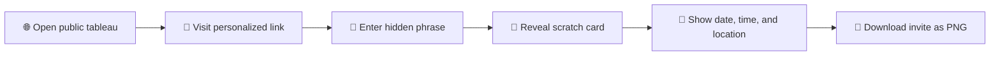

# Scratchcard Invites ✨

<p align="center">
  <strong>🎓 A bold Next.js experience for class graduation invites, digital tableau boards, and scratch-to-reveal notice cards.</strong>
</p>

<p align="center">
  
  
  
  
</p>

<p align="center">
  🌈 Teachers create a dramatic class showcase, invited guests unlock a private link with a hidden phrase, and the final invite appears as an interactive scratch card they can save as a PNG.
</p>

---

## 🌟 What Makes It Special

- 🎆 Feels like a digital graduation poster, not a plain invite page.
- 🔐 Each guest gets a unique private link and phrase check.
- 🪙 The reveal is tactile and playful with a scratch-off layer.
- 📸 The finished notice can be exported as a PNG and kept on the device.
- 🧠 Built to stay lightweight, fast, and focused on the invite experience.

## 🎭 The Experience

### 🏛 Public Tableau

The landing page opens like a stage: elegant, formal, and built to make the class feel celebrated.

### 🕵️ Private Invite

Every invited guest receives a unique link and must enter the hidden phrase before the notice opens.

### ✨ Scratch Reveal

The invite uses a scratch layer to uncover the date, time, and location in a more memorable way.

### 💾 Downloadable Card

Once revealed, the final invite can be exported as a PNG and saved directly to the device.

## 🚀 Flow at a Glance



## 🧰 Tech Stack

- Next.js 16 with the App Router
- TypeScript
- Tailwind CSS
- Supabase for authentication and persistence
- html2canvas for PNG export

## 📁 Project Structure

- `app/` - pages, layouts, and UI components
- `app/admin/` - admin tools for managing teachers, attempts, and invite content
- `app/invite/[slug]/` - personalized invite experience
- `app/api/` - route handlers for verification, notices, auth, and admin actions
- `lib/` - shared helpers for auth, Supabase, and phrase handling
- `db/migrations/` - SQL migrations and schema setup
- `scripts/` - utility scripts such as QR generation

## ⚡ Getting Started

```bash
npm install
npm run dev
```

Then open http://localhost:3000.

## 🛠 Available Scripts

- `npm run dev` - start the development server
- `npm run build` - create a production build
- `npm run lint` - run ESLint

## 📝 Notes

- The app uses modern `next/font` loading for typography.
- Supabase credentials are expected in `.env.local`.
- Run `npm run build` before deploying to catch production-only issues.

## 🌍 Deploy

The app is ready for deployment on Vercel or any platform that supports Next.js.
